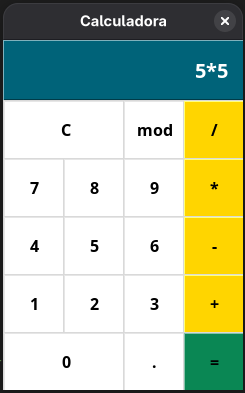

# Calculadora com Tkinter

Uma simples calculadora feita em Python utilizando a biblioteca Tkinter para interface gráfica. Este projeto permite operações básicas de adição, subtração, multiplicação, divisão, uso de ponto decimal e cálculo de módulo (resto da divisão).

## Funcionalidades

- Operações básicas: +, -, *, /
- Operador de módulo (mod) para calcular o resto da divisão
- Botão de limpar (C)
- Suporte ao ponto decimal (.)
- Limite de até 19 caracteres no visor
- Resultado exibido diretamente na tela após cálculo

## Tecnologias usadas

- Python 3
- Tkinter (GUI nativa do Python)

## Screenshot

